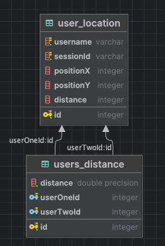

# User Location Challenge

## Description

Summary
Create a 1-page website that allows users to enter their position and a desired distance. The website will then display all other users within that distance from the entered position.

Requirements
User Input:
Users can enter:
- A username (must be unique across all users).
- A position (representing the user's current position). The position can be either:
    - Latitude/Longitude (if using this, the distance should be in miles).
    - X/Y coordinates (if using this, the distance can be unitless).
    - A distance.
- The website will persist the username and position entered.

Functionality:
- When a user enters their information, in addition to persisting it, the website will display the usernames of all other users whose positions are within the given distance from the entered position.
- The search results should exclude the user who performed the search.
- Each browser session represents a single user:
  - The first entry of user information will add a new user.
  - Subsequent entries will update the existing user's information.
  - Refreshing the page will clear any session information, effectively treating it as a new user.

Notes
If you choose to do lat/long, you can use this docker-compose file if you'd like to get postgis up and running.

```yml
version: '2'

services:
    db:
        image: 'postgis/postgis:11-3.3-alpine'
        container_name: db
        environment:
            - POSTGRES_DB=db
            - POSTGRES_USER=postgres
            - POSTGRES_PASSWORD=postgres
            - TZ=UTC
            - PGTZ=UTC
        volumes:
            - ./docker/postgres/docker-entrypoint-initdb.d:/docker-entrypoint-initdb.d
            - postgres:/var/lib/postgresql/data
        ports:
            - '5432:5432'

volumes:
    postgres:
```

# Solution

## Description

In my solution I chose to use the X/Y method which i thought was most interesting so that I would have to apply a 
custom implementation of the solution, although suboptimal due to obvious time limitation.

The solution has the following database :



* user_location table stores the user data like username, position and distance
* users_distance is a helper table that stores all distances between all users, this way filtering based on distance becomes extremely easy.

Each time a user enters or updates their distance these steps are run:

1. Saves data to _user_location_ table. If position or distance changed from last time it also: 
2. Deletes all distances in _users_distance_ related to the user
3. Calculates all distances from the user to all other users and saves them in bulk to _users_distance_

Distance is calculated using Euclidean distance.

Steps 2 and 3 are expensive writing operations that should be done in an asynchronous task.

The downside of this approach is that is not scalable this way as the more users are added the more expensive it is.

## How to Run

### Requisites

You just need a Postgresql database running locally at port 5432, user postgres and no password.

First run the api server:

```bash
  npm install
  npm run build:server
  npm run server
```

Then run the frontend:

```bash
  npm run build
  npm run dev
```

Open a browser with url http://localhost:8080

### Server

The server is an express server that has the following endpoints:

* /login: to retrieve the session data of the user
* /register: to save a new user. This endpoint also saves the sessionid of the user so that subsequent api calls are associated to same user
* /updateLocation: to save the position and distance the user chooses. This endpoint also updates all distance synchronously.
* /usersnearme: to retrieve the list of all users near the current user

A client like postman can be used to call these endpoints and run the same operations as the frontend. Sessionid can only
be forced if you know the client actual session id, the one stored in database is encrypted, losing the original value.

### Front-End

The frontend I ended up building it with React, Tailwind css for some styling, axios for client calls and some other libraries.

Refreshing the page restarts the sessionid of the user making it essentially a new user.

## Registration:


## Updating position:


## Results:


### Database state at the time of result:

_user_location_ table:

| id | username | sessionId | positionX | positionY | distance |
| :--- | :--- | :--- | :--- | :--- | :--- |
| 1 | theflash | PIw7pP0\_NSvCHcgf\_Da11dZ6DJXdxc6W | 8 | 6 | 5 |
| 2 | batman | lbJ7ew6P38h-zWRTZcBSBbT89lZbBNKM | 2 | 3 | 15 |
| 3 | spiderman | Yl8le6wYMCTezTv91JLFwNQrscjsXY9r | 1 | 1 | 2 |
| 4 | captainamerica | kb9sakviD9uiZI-WxPxpmhPi\_p8xVFOR | 0 | 0 | 2 |
| 5 | mfavale | Tltb4E1qGj\_JaklM2YW8akbvMzjc4Aa4 | 4 | 4 | 8 |
| 6 | wonderwoman | w1-BksLehyilpXimoMF4Ktu1MmTESppX | 8 | 8 | 4 |
| 9 | superman | sJH-GRog5tYBhtHSXan8ragiwg\_8TW\_i | 10 | 12 | 12 |
| 10 | superwoman | fDtMOhGZgU0sMYINOFxkhX1pOV1wM869 | 11 | 12 | 11 |
| 11 | greenlantern | gnJbNHD8ElEg9EVcQU\_h9uKB3KSfW\_uo | 15 | 18 | 14 |
| 12 | aquaman | 3cTWrKR1zJvy01Mvkq7AR-uIiG\_OGHZT | -1 | -5 | 10 |
| 13 | cyborg | dPvNLvjyETmY6PPicfaqDBMy46hbO6Px | -2 | -6 | 13 |
| 14 | blackcanary | nFN03sCARQ0Mm13lDMFX0ayG-ZZislTP | -8 | 0 | 5 |
| 15 | martianmanhunter | 3ooVVvu-823z3m\_zPc5dTG6z1gBBIRFf | -1 | 4 | 3 |
| 16 | hawkman | c8zGrB1RaTFtXEJm3XUyw6DOSZ2\_b9eN | 15 | 18 | 13 |
| 17 | firestorm | HQU6ICblqKYJ1jCLRtZivF2Ih3eiKYj8 | 10 | 22 | 9 |
| 38 | elongatedman | joGaIEPYnEWvR1nHDvTr\_RsLTVsKr8i6 | 1 | 1 | 1 |
| 39 | captainmarvel | zNSnZH31K-CBWjXp926\_6BmUTpmNvyj1 | 2 | 2 | 5 |
| 40 | raypalmer | 16OVaHm-Ws1UpgAYL6ISfaipDVnivxTv | 1 | 4 | 5 |
| 41 | atom | VEQYCW4BCIq5m5O46YYsgOsVx4cYLYEe | 2 | 2 | 5 |
| 42 | boostergold | 9KD2rnCg9k8YvVKfLbUIigra6KDTYVoR | 6 | 5 | 10 |
| 44 | danclaroni | 1COTMbHHpyBVgxtforRm9x\_84nHmgAJ1 | 0 | 0 | 5 |
| 43 | hawkeye | agKEq-lMS\_Sb4wd-t31-sC2mVF\_JnhQz | -1 | 3 | 5 |

_users_distance_ table:

| id | distance | userOneId | userTwoId |
| :--- | :--- | :--- | :--- |
| 1 | 6.708203932499369 | 2 | 1 |
| 2 | 8.602325267042627 | 3 | 1 |
| 3 | 2.23606797749979 | 3 | 2 |
| 4 | 10 | 4 | 1 |
| 5 | 3.605551275463989 | 4 | 2 |
| 6 | 1.4142135623730951 | 4 | 3 |
| 7 | 4.47213595499958 | 5 | 1 |
| 8 | 2.23606797749979 | 5 | 2 |
| 9 | 4.242640687119285 | 5 | 3 |
| 10 | 5.656854249492381 | 5 | 4 |
| 11 | 2 | 6 | 1 |
| 12 | 7.810249675906654 | 6 | 2 |
| 13 | 9.899494936611665 | 6 | 3 |
| 14 | 11.313708498984761 | 6 | 4 |
| 15 | 5.656854249492381 | 6 | 5 |
| 16 | 6.324555320336759 | 9 | 1 |
| 17 | 12.041594578792296 | 9 | 2 |
| 18 | 14.212670403551895 | 9 | 3 |
| 19 | 15.620499351813308 | 9 | 4 |
| 20 | 10 | 9 | 5 |
| 21 | 4.47213595499958 | 9 | 6 |
| 22 | 6.708203932499369 | 10 | 1 |
| 23 | 12.727922061357855 | 10 | 2 |
| 24 | 14.866068747318506 | 10 | 3 |
| 25 | 16.278820596099706 | 10 | 4 |
| 26 | 10.63014581273465 | 10 | 5 |
| 27 | 5 | 10 | 6 |
| 28 | 1 | 10 | 9 |
| 29 | 13.892443989449804 | 11 | 1 |
| 30 | 19.849433241279208 | 11 | 2 |
| 31 | 22.02271554554524 | 11 | 3 |
| 32 | 23.430749027719962 | 11 | 4 |
| 33 | 17.804493814764857 | 11 | 5 |
| 34 | 12.206555615733702 | 11 | 6 |
| 35 | 7.810249675906654 | 11 | 9 |
| 36 | 7.211102550927978 | 11 | 10 |
| 37 | 14.212670403551895 | 12 | 1 |
| 38 | 8.54400374531753 | 12 | 2 |
| 39 | 6.324555320336759 | 12 | 3 |
| 40 | 5.0990195135927845 | 12 | 4 |
| 41 | 10.295630140987 | 12 | 5 |
| 42 | 15.811388300841896 | 12 | 6 |
| 43 | 20.248456731316587 | 12 | 9 |
| 44 | 20.808652046684813 | 12 | 10 |
| 45 | 28.0178514522438 | 12 | 11 |
| 46 | 15.620499351813308 | 13 | 1 |
| 47 | 9.848857801796104 | 13 | 2 |
| 48 | 7.615773105863909 | 13 | 3 |
| 49 | 6.324555320336759 | 13 | 4 |
| 50 | 11.661903789690601 | 13 | 5 |
| 51 | 17.204650534085253 | 13 | 6 |
| 52 | 21.633307652783937 | 13 | 9 |
| 53 | 22.20360331117452 | 13 | 10 |
| 54 | 29.410882339705484 | 13 | 11 |
| 55 | 1.4142135623730951 | 13 | 12 |
| 56 | 17.08800749063506 | 14 | 1 |
| 57 | 10.44030650891055 | 14 | 2 |
| 58 | 9.055385138137417 | 14 | 3 |
| 59 | 8 | 14 | 4 |
| 60 | 12.649110640673518 | 14 | 5 |
| 61 | 17.88854381999832 | 14 | 6 |
| 62 | 21.633307652783937 | 14 | 9 |
| 63 | 22.47220505424423 | 14 | 10 |
| 64 | 29.206163733020468 | 14 | 11 |
| 65 | 8.602325267042627 | 14 | 12 |
| 66 | 8.48528137423857 | 14 | 13 |
| 67 | 9.219544457292887 | 15 | 1 |
| 68 | 3.1622776601683795 | 15 | 2 |
| 69 | 3.605551275463989 | 15 | 3 |
| 70 | 4.123105625617661 | 15 | 4 |
| 71 | 5 | 15 | 5 |
| 72 | 9.848857801796104 | 15 | 6 |
| 73 | 13.601470508735444 | 15 | 9 |
| 74 | 14.422205101855956 | 15 | 10 |
| 75 | 21.2602916254693 | 15 | 11 |
| 76 | 9 | 15 | 12 |
| 77 | 10.04987562112089 | 15 | 13 |
| 78 | 8.06225774829855 | 15 | 14 |
| 79 | 13.892443989449804 | 16 | 1 |
| 80 | 19.849433241279208 | 16 | 2 |
| 81 | 22.02271554554524 | 16 | 3 |
| 82 | 23.430749027719962 | 16 | 4 |
| 83 | 17.804493814764857 | 16 | 5 |
| 84 | 12.206555615733702 | 16 | 6 |
| 85 | 7.810249675906654 | 16 | 9 |
| 86 | 7.211102550927978 | 16 | 10 |
| 87 | 0 | 16 | 11 |
| 88 | 28.0178514522438 | 16 | 12 |
| 89 | 29.410882339705484 | 16 | 13 |
| 90 | 29.206163733020468 | 16 | 14 |
| 91 | 21.2602916254693 | 16 | 15 |
| 92 | 16.1245154965971 | 17 | 1 |
| 93 | 20.615528128088304 | 17 | 2 |
| 94 | 22.847319317591726 | 17 | 3 |
| 95 | 24.166091947189145 | 17 | 4 |
| 96 | 18.973665961010276 | 17 | 5 |
| 97 | 14.142135623730951 | 17 | 6 |
| 98 | 10 | 17 | 9 |
| 99 | 10.04987562112089 | 17 | 10 |
| 100 | 6.4031242374328485 | 17 | 11 |
| 101 | 29.154759474226502 | 17 | 12 |
| 102 | 30.463092423455635 | 17 | 13 |
| 103 | 28.42534080710379 | 17 | 14 |
| 104 | 21.095023109728988 | 17 | 15 |
| 105 | 6.4031242374328485 | 17 | 16 |
| 106 | 8.602325267042627 | 38 | 1 |
| 107 | 2.23606797749979 | 38 | 2 |
| 108 | 0 | 38 | 3 |
| 109 | 1.4142135623730951 | 38 | 4 |
| 110 | 4.242640687119285 | 38 | 5 |
| 111 | 9.899494936611665 | 38 | 6 |
| 112 | 14.212670403551895 | 38 | 9 |
| 113 | 14.866068747318506 | 38 | 10 |
| 114 | 22.02271554554524 | 38 | 11 |
| 115 | 6.324555320336759 | 38 | 12 |
| 116 | 7.615773105863909 | 38 | 13 |
| 117 | 9.055385138137417 | 38 | 14 |
| 118 | 3.605551275463989 | 38 | 15 |
| 119 | 22.02271554554524 | 38 | 16 |
| 120 | 22.847319317591726 | 38 | 17 |
| 121 | 7.211102550927978 | 39 | 1 |
| 122 | 1 | 39 | 2 |
| 123 | 1.4142135623730951 | 39 | 3 |
| 124 | 2.8284271247461903 | 39 | 4 |
| 125 | 2.8284271247461903 | 39 | 5 |
| 126 | 8.48528137423857 | 39 | 6 |
| 127 | 12.806248474865697 | 39 | 9 |
| 128 | 13.45362404707371 | 39 | 10 |
| 129 | 20.615528128088304 | 39 | 11 |
| 130 | 7.615773105863909 | 39 | 12 |
| 131 | 8.94427190999916 | 39 | 13 |
| 132 | 10.198039027185569 | 39 | 14 |
| 133 | 3.605551275463989 | 39 | 15 |
| 134 | 20.615528128088304 | 39 | 16 |
| 135 | 21.540659228538015 | 39 | 17 |
| 136 | 1.4142135623730951 | 39 | 38 |
| 137 | 7.280109889280518 | 40 | 1 |
| 138 | 1.4142135623730951 | 40 | 2 |
| 139 | 3 | 40 | 3 |
| 140 | 4.123105625617661 | 40 | 4 |
| 141 | 3 | 40 | 5 |
| 142 | 8.06225774829855 | 40 | 6 |
| 143 | 12.041594578792296 | 40 | 9 |
| 144 | 12.806248474865697 | 40 | 10 |
| 145 | 19.79898987322333 | 40 | 11 |
| 146 | 9.219544457292887 | 40 | 12 |
| 147 | 10.44030650891055 | 40 | 13 |
| 148 | 9.848857801796104 | 40 | 14 |
| 149 | 2 | 40 | 15 |
| 150 | 19.79898987322333 | 40 | 16 |
| 151 | 20.12461179749811 | 40 | 17 |
| 152 | 3 | 40 | 38 |
| 153 | 2.23606797749979 | 40 | 39 |
| 154 | 7.211102550927978 | 41 | 1 |
| 155 | 1 | 41 | 2 |
| 156 | 1.4142135623730951 | 41 | 3 |
| 157 | 2.8284271247461903 | 41 | 4 |
| 158 | 2.8284271247461903 | 41 | 5 |
| 159 | 8.48528137423857 | 41 | 6 |
| 160 | 12.806248474865697 | 41 | 9 |
| 161 | 13.45362404707371 | 41 | 10 |
| 162 | 20.615528128088304 | 41 | 11 |
| 163 | 7.615773105863909 | 41 | 12 |
| 164 | 8.94427190999916 | 41 | 13 |
| 165 | 10.198039027185569 | 41 | 14 |
| 166 | 3.605551275463989 | 41 | 15 |
| 167 | 20.615528128088304 | 41 | 16 |
| 168 | 21.540659228538015 | 41 | 17 |
| 169 | 1.4142135623730951 | 41 | 38 |
| 170 | 0 | 41 | 39 |
| 171 | 2.23606797749979 | 41 | 40 |
| 172 | 2.23606797749979 | 42 | 1 |
| 173 | 4.47213595499958 | 42 | 2 |
| 174 | 6.4031242374328485 | 42 | 3 |
| 175 | 7.810249675906654 | 42 | 4 |
| 176 | 2.23606797749979 | 42 | 5 |
| 177 | 3.605551275463989 | 42 | 6 |
| 178 | 8.06225774829855 | 42 | 9 |
| 179 | 8.602325267042627 | 42 | 10 |
| 180 | 15.811388300841896 | 42 | 11 |
| 181 | 12.206555615733702 | 42 | 12 |
| 182 | 13.601470508735444 | 42 | 13 |
| 183 | 14.866068747318506 | 42 | 14 |
| 184 | 7.0710678118654755 | 42 | 15 |
| 185 | 15.811388300841896 | 42 | 16 |
| 186 | 17.46424919657298 | 42 | 17 |
| 187 | 6.4031242374328485 | 42 | 38 |
| 188 | 5 | 42 | 39 |
| 189 | 5.0990195135927845 | 42 | 40 |
| 190 | 5 | 42 | 41 |
| 1471 | 9.486832980505138 | 43 | 1 |
| 1472 | 3 | 43 | 2 |
| 1473 | 2.8284271247461903 | 43 | 3 |
| 1474 | 3.1622776601683795 | 43 | 4 |
| 1475 | 5.0990195135927845 | 43 | 5 |
| 1476 | 10.295630140987 | 43 | 6 |
| 1477 | 14.212670403551895 | 43 | 9 |
| 1478 | 15 | 43 | 10 |
| 1479 | 21.93171219946131 | 43 | 11 |
| 1480 | 8 | 43 | 12 |
| 1481 | 9.055385138137417 | 43 | 13 |
| 1482 | 7.615773105863909 | 43 | 14 |
| 1483 | 1 | 43 | 15 |
| 1484 | 21.93171219946131 | 43 | 16 |
| 1485 | 21.95449840010015 | 43 | 17 |
| 1486 | 2.8284271247461903 | 43 | 38 |
| 1487 | 3.1622776601683795 | 43 | 39 |
| 1488 | 2.23606797749979 | 43 | 40 |
| 1489 | 3.1622776601683795 | 43 | 41 |
| 1490 | 7.280109889280518 | 43 | 42 |
| 2478 | 10 | 44 | 1 |
| 2479 | 3.605551275463989 | 44 | 2 |
| 2480 | 1.4142135623730951 | 44 | 3 |
| 2481 | 0 | 44 | 4 |
| 2482 | 5.656854249492381 | 44 | 5 |
| 2483 | 11.313708498984761 | 44 | 6 |
| 2484 | 15.620499351813308 | 44 | 9 |
| 2485 | 16.278820596099706 | 44 | 10 |
| 2486 | 23.430749027719962 | 44 | 11 |
| 2487 | 5.0990195135927845 | 44 | 12 |
| 2488 | 6.324555320336759 | 44 | 13 |
| 2489 | 8 | 44 | 14 |
| 2490 | 4.123105625617661 | 44 | 15 |
| 2491 | 23.430749027719962 | 44 | 16 |
| 2492 | 24.166091947189145 | 44 | 17 |
| 2493 | 1.4142135623730951 | 44 | 38 |
| 2494 | 2.8284271247461903 | 44 | 39 |
| 2495 | 4.123105625617661 | 44 | 40 |
| 2496 | 2.8284271247461903 | 44 | 41 |
| 2497 | 7.810249675906654 | 44 | 42 |
| 2498 | 3.1622776601683795 | 44 | 43 |

